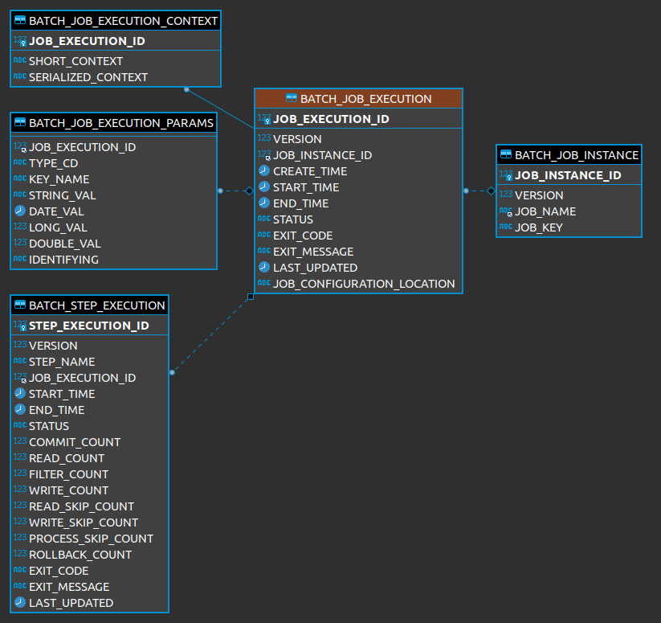
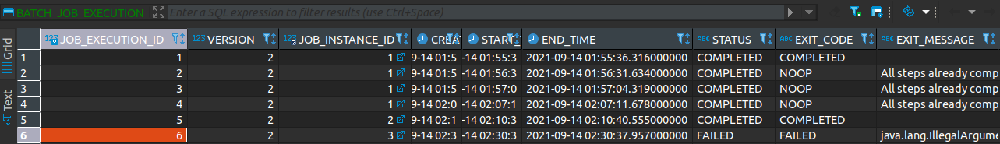
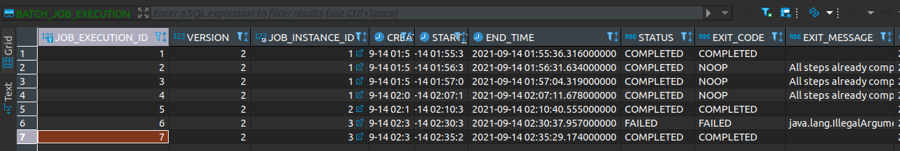

# BATCH_JOB_EXECUTION

---

JOB_EXECUTION과 JOB_INSTANCE는 부모 자식 관계

---

JOB_EXECUTION은 JOB_INSTANCE가 성공/실패 했던 모든 내역을 갖고 있다.

---

실패했던 step1을 다시 성공적으로 적용했을 경우  
JOB_EXECUTION의 JOB_INSTANCE_ID가 동일하게 3으로 기록 된다.

즉 동일한 Job Parameter로 BATCH_JOB_INSTANCE가 2번 실행되었고 첫번째는 실패, 두번째는 성공  
이로서 Job Parameter가 같아도 Fail한 Instance의 경우 재수행 가능하다는 것을 확인했다.

---

Spring batch의 Job이 Job Parameter별로 실행되며 JOB_INSTANCE를 생성하며  
JOB_INSTANCE가 실행 시도한 기록이 JOB_EXECUTION에 저장된다.

위에서 Job Parameter는 JOB_EXECUTION_PARAMS에 저장된다.