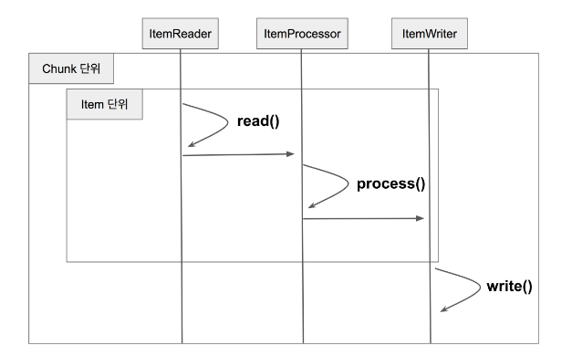

# Chunk

---

덩어리로 작업시 각 커밋 사이에 처리되는 row 수  

Chunk 지향 처리란 한번에 하나씩 데이터를 읽어 Chunk라는 덩어리를 만든 뒤,  
Chunk 단위로 트랜젝션을 다루는 것

Chunk 단위로 트랜잭션을 수행하기 때문에 실패할 경우 해당 Chunk 만큼 롤백 되고,  
이전에 커밋된 트랜잭션 범위까지는 반영이 된다.

  

[AlphabetJobConfig](../src/main/java/me/zeroest/spring_batch/job/alphabet/AlphabetJobConfig.java)  

1. Reader에서 데이터를 하나 읽어오고  
2. 읽어온 데이터를 Processor에서 가공하고
3. 가공된 데이터들을 별도의 공간에 모은 뒤, Chunk 단위 만큼 쌓이게 되면
4. Writer에 전달하고 Writer는 일괄 저장한다.
즉 Reader와 Processor에서 1건식 다뤄지고 Writer에선 Chunk 단위로 처리된다

```java
for(int i=0; i<totalSize; i+=chunkSize){ // chunkSize 단위로 묶어서 처리
    List items = new Arraylist();
    for(int j = 0; j < chunkSize; j++){
        Object item = itemReader.read()
        Object processedItem = itemProcessor.process(item);
        items.add(processedItem);
    }
    itemWriter.write(items);
}
```

ChunkOrientedTasklet  
SimpleChunkProvider  
SimpleChunkProcessor  

> https://jojoldu.tistory.com/331?category=902551  
> 밑에 댓글에 참조할 자료도 많아서 확인해볼것

아직 글을 읽어도 도통 감이 오지 않으니 이해가 잘 안된다... ㅠ
