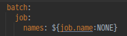

# Spring batch job names

---

기존의 SimpleJob과 StepNextJob이 중복으로 실행되기 때문에  
application.yml 파일의 batch.job.names 설정을 위와 같이 설정  
Run Configuration에서 Program arguments 설정으로 특정 Job만 실행하게 한다.  
`--job.name=stepNextJob`

실제 운영 환경에서는 `java -jar batch-application.jar --job.name=simpleJob` 와 같이 배치를 실행한다.

