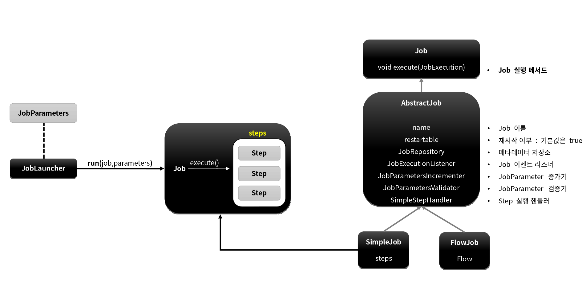
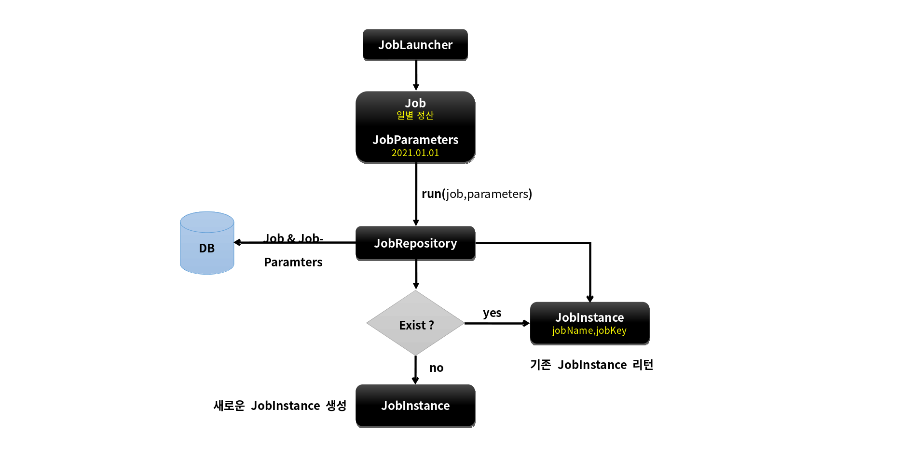
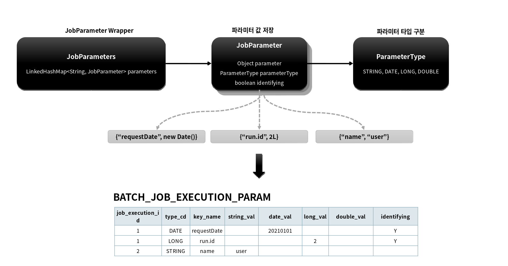
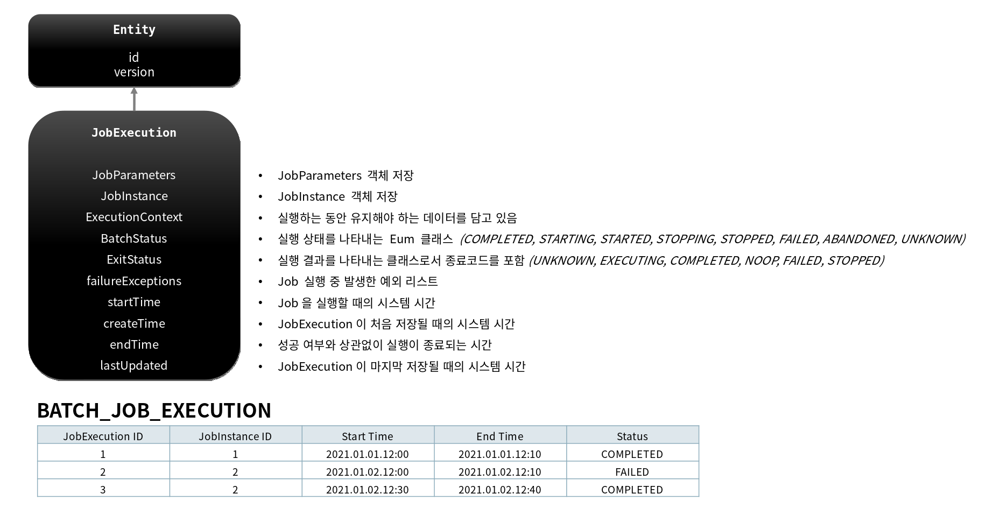
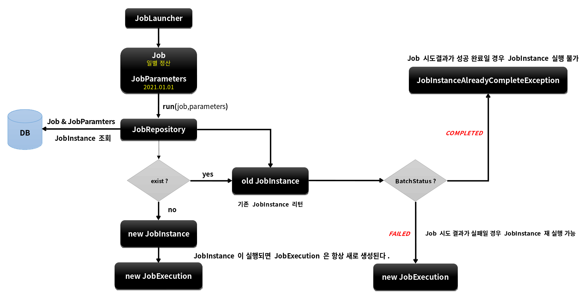
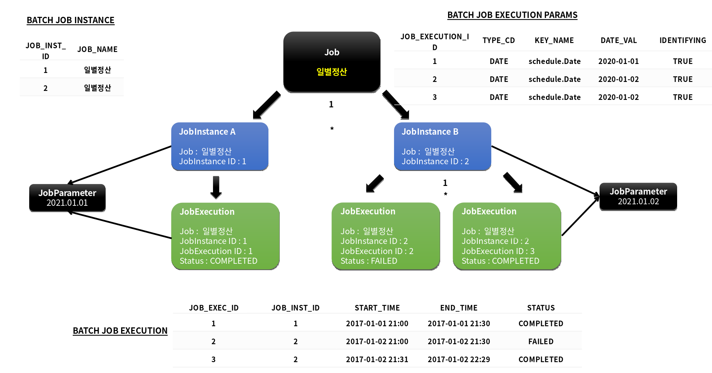

# 배치 도메인 

---

# Job

## 개념

- 배치 계층 구조에서 가장 상위에 있는 개념, 하나의 배치작업 자체를 의미

  - "API서버의 접속 로그 데이터를 통계 서버로 옮기는 배치" 인 Job 자체를 의미

- Job Configuration을 통해 생성되는 객체 단위로서 배치작업을 어떻게 구성하고 실행할 것인지 전체적으로 설정하고 명세해 놓은 객체 

- 배치 Job을 구성하기 위한 최상위 인터페이스, 스프링 배치가 기본 구현체를 제공한다

- 여러 Step을 포함하고 있는 컨테이너로서 반드시 한개 이상의 Step으로 구성해야 함

## 기본 구현체

- SimpleJob

  - 순차적으로 Step을 실행시키는 Job
  - 모든 Job에서 유용하게 사용할 수 있는 표준 기능을 갖고 있음

- FlowJob

  - 특정한 조건과 흐름에 따라 Step을 구성하여 실행시키는 Job
  - Flow 객체를 실행시켜서 작업을 진행함 

## 클래스 구성

--- 

# JobInstance

## 개념 

- Job이 실행될 때 생성되는 Job의 논리적 실행단위 객체로 고유하게 식별 가능한 작업 실행을 나타냄

- Job의 설정과 구성은 동일하지만 Job이 실행되는 시점에 처리하는 내용은 다르기 때문에 Job의 실행을 구분해야 함

  - 하루에 한번씩 배치 Job이 실행된다면 매일 실행되는 각각의 Job을 JobInstance로 표현한다

- JobInstance 생성 및 실행

  - 처음 시작하는 Job + JobParameter 일 경우 새로운 JobInstance 생성
  - 이전과 동일한 Job + JobParameter 로 실행 할 경우 이미 존재하는 JobInstance 리턴
     - 내부적으로 JobName + jobKey(jobParameters의 해시값) 를 가지고 JobInstance 객체 얻음

- Job과는 1:N 관계

## BATCH_JOB_INSTANCE 테이블과 매핑 

- JOB_NAME (job) 과 JOB_KEY (jobParameter 해시값) 가 동일한 데이터는 중복해서 저장할 수 없음 

---

# JobParameter

## 개념

- Job을 실행할 때 함께 포함되어 사용되는 파라미터를 가진 도메인 객체

- 하나의 Job에 존재할 수 있는 여러개의 JobInstance를 구분하기 위한 용도

- JobParameters와 JobInstance는 1:1 관계

## 생성 및 바인딩

- 어플리케이션 실행 시 주입

  - Java -jar LogBatch.jar requestDate(date)=2021/01/ 01 name=user1 seq(long)=2L age(double)=12.3

- 코드로 생성

  - JobParameterBuilder, DefaultJobParametersConverter

- SpEL 이용 

  - @Value("#{jobParameter[requestDate]}"), @JobScope, @StepScope 선언 필수 
  
## BATCH_JOB_EXECUTION_PARAM 테이블과 매핑

- JOB_EXECUTION 과 1:N 의 관계 

---

# JobExecution

## 개념

- JobInstance에 대한 한번의 시도를 의미하는 객체로서 Job 실행 중에 발생한 정보들을 저장하고 있는 객체

  - 시작시간, 종료시간, 상태(시작됨, 완료, 실패), 종료상태의 속성을 가짐

- JobInstance 과의 관계

  - JobExecution은 'FAILED' 또는 'COMPLETED' 등의 Job의 실행 결과 상태를 가지고 있음
  - JobExecution의 실행 상태 결과가 'COMPLETED' 면 JobInstance 실행이 완료된 것으로 간주해서 재 실행이 불가함
  - JobExecution의 실행 상태 결과가 'FAILED' 면 JobInstance 실행이 완료되지 않은 것으로 간주해서 재실행이 가능함
    - JobParameter 가 동일한 값으로 Job을 실행할지라도 JobInstance를 계속 실행할 수 있음 
  - JobExecution의 실행 상태 결과가 'COMPLETED' 될 때까지 하나의 JobInstance 내에서 여러번의 시도가 생길 수 있음

## BATCH_JOB_EXECUTION 테이블과 매핑

- JobInstance와 JobExecution은 1:N 의 관계로서 JobInstance에 대한 성공/실패의 내역을 가지고 있음

