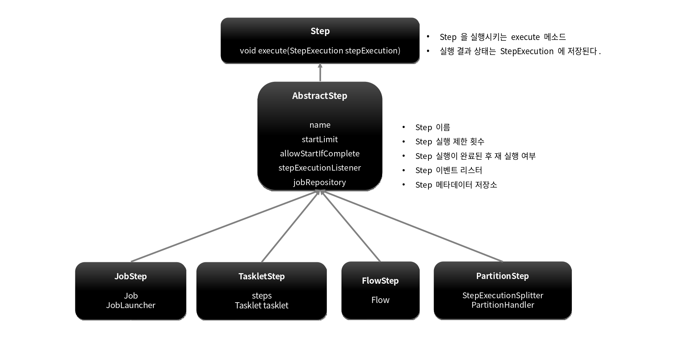
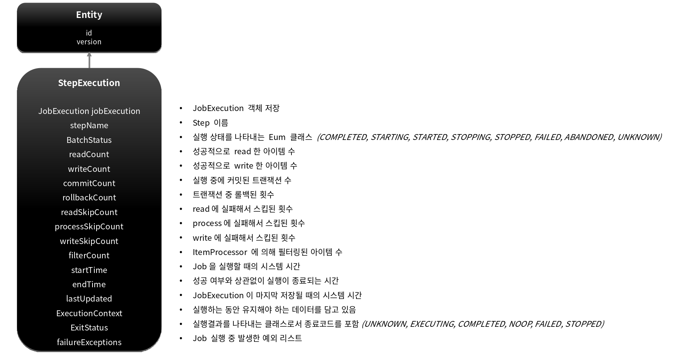
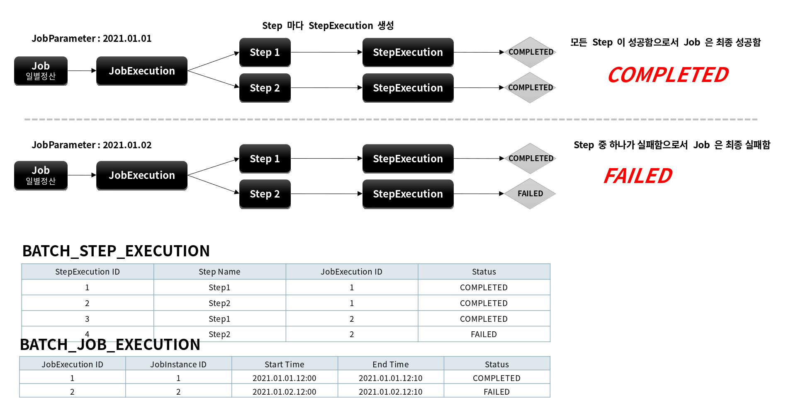
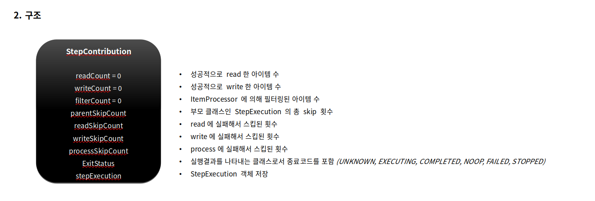
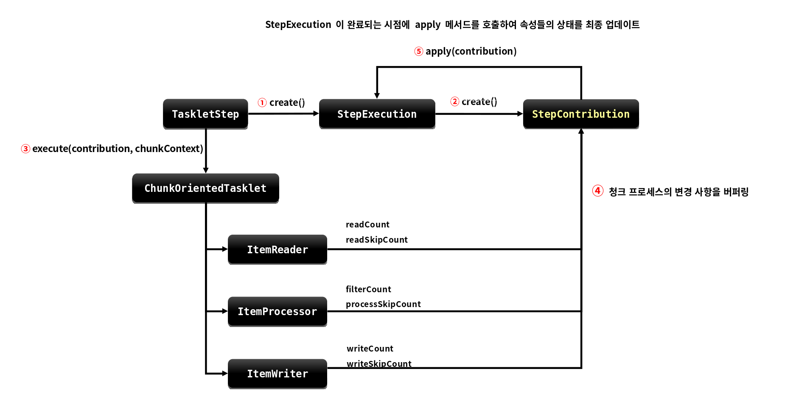

# 배치 도메인 

---

# Step

## 개념

- Batch Job을 구성하는 독립적인 하나의 단계로서 실제 배치 처리를 정의하고 컨트롤하는 데 필요한 모든 정보를 가지고 있는 도메인 객체 

- 단순한 단일 태스크 뿐 아니라 입력과 처리 그리고 출력과 관련된 복잡한 비즈니스 로직을 포함하는 모든 설정들을 담고 있다. 

- 배치작업을 어떻게 구성하고 실행할 것인지 Job의 세부 작업을 Task 기반으로 설정하고 명세해 놓은 객체

- 모든 Job은 하나 이상의 Step으로 구성됨 


## 기본 구현체

- TaskletStep

  - 가장 기본이 되는 클래스로서 Tasklet 타입의 구현체들을 제어한다

- PartitionStep

  - 멀티 스레드 방식으로 Step을 여러 개로 분리해서 실행한다 

- JobStep

  - Step 내에서 Job을 실행하도록 한다

- FlowStep

  - Step 내에서 Flow를 실행하도록 한다 




## API 설정에 따른 Step 생성

### TaskletStep

직접 생성한 Tasklet 실행
```java
public Step taskletStep(){
    return stepBuilderFactory.get("step")
        .tasklet(myTasklet())
        .build();
}
```

### TaskletStep

ChunkOrientedTasklet 실행
```java
public Step taskletStep(){
    return stepBuilderFactory.get("step")
        .<Member, Member> chunk(100)
        .reader(reader())
        .writer(writer())
        .build();
}
```

### JobStep

Step에서 Job을 실행
```java
public Step taskletStep(){
    return stepBuilderFactory.get("step")
        .job(job())
        .launcher(jobLauncher)
        .parametersExtractor(jobParameterExtractor())
        .build();
}
```

### FlowStep

Step에서 Flow를 실행
```java
public Step taskletStep(){
    return stepBuilderFactory.get("step")
        .flow(myFlow())
        .build();
}
```

---

# StepExecution

## 개념

- Step에 대한 한번의 시도를 의미하는 객체로서 Step 실행 중에 발생한 정보들을 저장하고 있는 객체

  - 시작시간, 종료시간, 상태(시작됨, 완료, 실패), Commit count, Rollback count 등의 속성을 가짐 

- Step이 매번 시도될 때마다 생성되며 각 Step 별로 생성된다 

- Job이 재시작 하더라도 이미 성공적으로 완료된 Step은 재실행되지 않고 실패한 Step 만 실행된다

- 이전 단계 Step이 실패해서 현재 Step을 실행하지 않았다면 StepExecution을 생성하지 않는다. Step이 실제로 시작됐을 때만 StepExecution을 생성한다 

- JobExecution과의 관계

  - Step의 StepExecution이 모두 정상적으로 완료 되어야 JobExecution이 정상적으로 완료된다 
  - Step의 StepExecution 중 하나라도 실패하면 JobExecution은 실패한다 

## BATCH_STEP_EXECUTION 테이블과 매핑

- JobExecution과 StepExecution은 1:N의 관계 
- 하나의 Job에 여러 개의 Step으로 구성했을 경우 각 StepExecution은 하나의 JobExecution을 부모로 가진다 






---

# StepContribution

## 개념

- 청크 프로세스의 변경 사항을 버퍼링 한 후 StepExecution 상태를 업데이트하는 도메인 객체

- 청크 커밋 직전에 StepExecution의 apply 메서드를 호출하여 상태를 업데이트 함

- ExitStatus의 기본 종료코드 외 사용자 정의 종료코드를 생성해서 적용 할 수 있음




