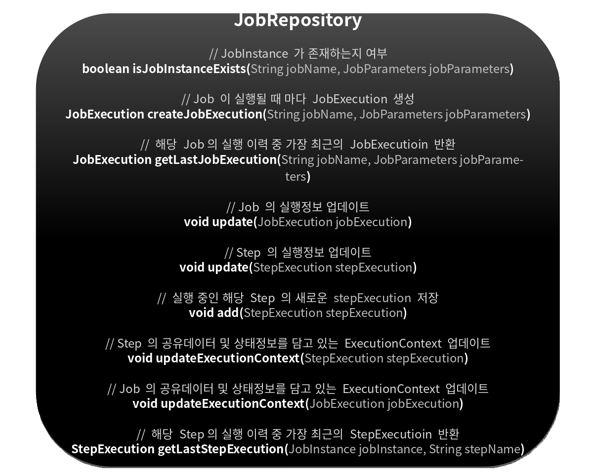
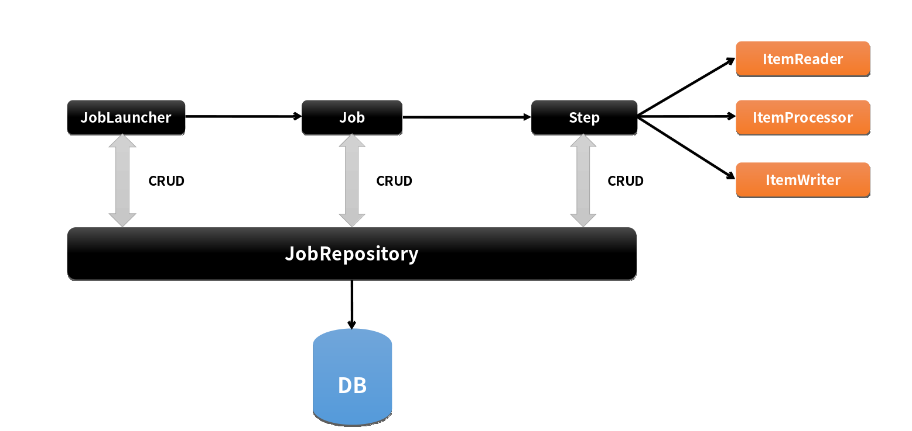

# 배치 도메인

---

# JobRepository

## 개념

- 배치 작업 중의 정볼르 저장하는 저장소 역할

- Job이 언제 수행되었고, 언제 끝났으며, 몇번이 실행되었고 실행에 대한 결과 등의 배치 작업의 수행과 관련된 모든 meta data를 저장

  - JobLauncher, Job, Step 구현체 내부에서 CRUD 기능을 처리함 





## JobRepository 설정

- @EnableBatchProcessing 어노테이션만 선언하면 JobRepository가 자동으로 빈으로 생성됨

- BatchConfigurer 인터페이스를 구현하거나 BasicBatchConfigurer를 상속해서 JobRepository 설정을 커스터마이징 할 수 있다

  - JDBC 방식으로 설정 - JobRepositoryFactoryBean
  
    - 내부적으로 AOP 기술을 통해 트랜잭션 처리를 해주고 있음
    - 트랜잭션 isolation의 기본값은 SERIALIZABLE로 최고 수준, 다른 레벨(READ_COMMITED, REPEATABLE_READ)로 지정 가능
    - 메타테이블의 Table Prefix 를 변경할 수 있음, 기본 값은 "BATCH_"

```java
@Override
protected JobRepository createJobRepository() throws Exception {
    JobRepositoryFactoryBean factory = new JobRepositoryFactoryBean();
    factory.setDataSource(dataSource);
    factory.setTransactionManager(transactionManager);
    factory.setIsolationLevelForCreate("ISOLATION_SERIALIZABLE"); // isolation 수준, 기본값은 “ISOLATION_SERIALIZABLE”
    factory.setTablePrefix(“SYSTEM_"); // 테이블 Prefix, 기본값은 “BATCH_”, BATCH_JOB_EXECUTION 가 SYSTEM_JOB_EXECUTION 으로 변경됨
    factory.setMaxVarCharLength(1000); // varchar 최대 길이(기본값 2500)
    return factory.getObject(); // Proxy 객체가 생성됨 (트랜잭션 Advice 적용 등을 위해 AOP 기술 적용)
}
```

  - In Memory 방식으로 설정 - MapJobRepositoryFactoryBean

    - 성능 등의 이유로 도메인 오브젝트를 굳이 데이터베이스에 저장하고 싶지 않은 경우
    - 보통 Test 나 프로토타입의 빠른 개발이 필요할 때 사용

```java
@Override
protected JobRepository createJobRepository() throws Exception {
    MapJobRepositoryFactoryBean factory = new MapJobRepositoryFactoryBean();
    factory.setTransactionManager(transactionManager); // ResourcelessTransactionManager 사용
    return factory.getObject();
}
```

참조
SimpleJobLauncher -> SimpleJobRepository -> JdbcJobInstanceDao