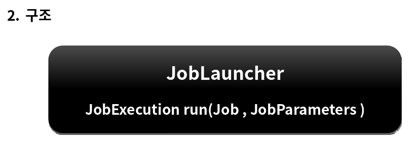
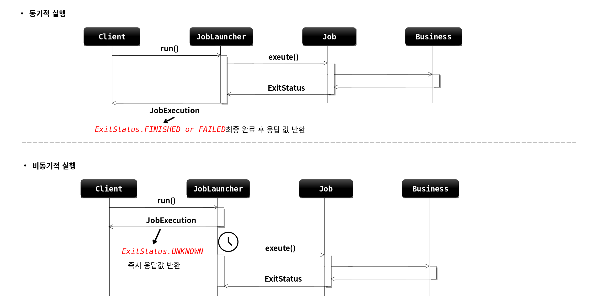

# 배치 도메인

---

# JobLauncher

## 개념

- 배치 Job을 실행시키는 역할을 한다 

- Job과 JobParameters를 인자로 받으며 요청된 배치 작업을 수행한 후 최종 client 에게 JobExecution을 반환한다 

- 스프링 부트 배치가 구동이 되면 JobLauncher 빈이 자동 생성된다 

## Job 실행 

- JobLauncher.run(Job, JobParameters);

- 스프링 부트 배치에서는 JobLauncherApplicationRunner 가 자동적으로 JobLauncher를 실행시킨다

### 동기적 실행

- taskExecutor 를 SyncTaskExecutor 로 설정할 경우 (기본값 SyncTaskExecutor)

- JobExecution 을 획득하고 배치 처리를 최종 완료한 이후 Client 에게 JobExecution 을 반환 

- 스케줄러에 의한 배치처리에 적합 함 - 배치처리시간이 길어도 상관없는 경우 

### 비 동기적 실행

- taskExecutor 를 SimpleAsyncTaskExecutor로 설정할 경우 

- JobExecution 을 획득한 후 Client 에게 바로 JobExecution 을 반환하고 배치처리를 완료한다

- HTTP 요청에 의한 배치처리에 적합함 - 배치처리 시간이 길 경우 응답이 늦어지지 않도록 함 

참고

1. BatchAutoConfiguration -> JobLauncherApplicationRunner -> execute

2. SimpleJobLauncher -> afterProertiesSet -> SyncTaskExecutor

3. SimpleJobLauncher -> setTaskExecutor()
