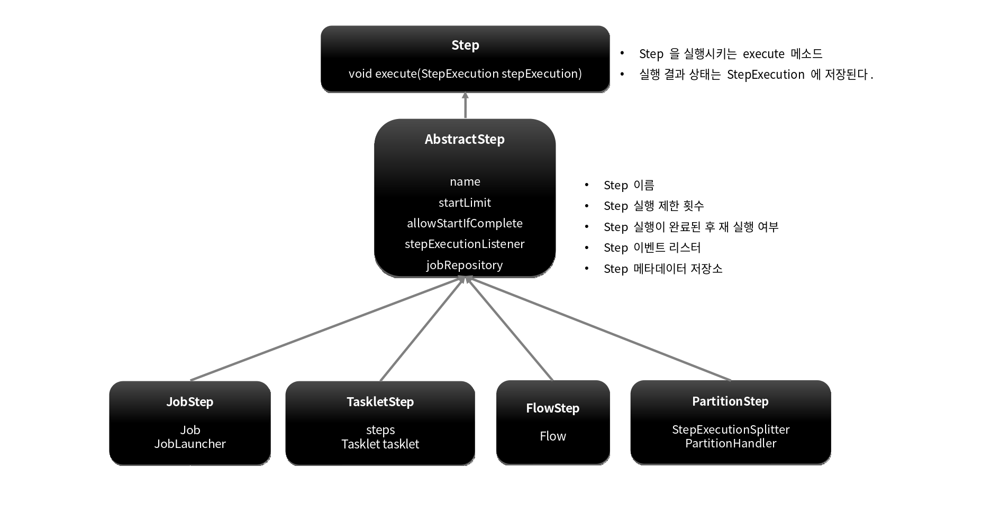

# 배치 도메인 

---

# Step

## 개념

- Batch Job을 구성하는 독립적인 하나의 단계로서 실제 배치 처리를 정의하고 컨트롤하는 데 필요한 모든 정보를 가지고 있는 도메인 객체 

- 단순한 단일 태스크 뿐 아니라 입력과 처리 그리고 출력과 관련된 복잡한 비즈니스 로직을 포함하는 모든 설정들을 담고 있다. 

- 배치작업을 어떻게 구성하고 실행할 것인지 Job의 세부 작업을 Task 기반으로 설정하고 명세해 놓은 객체

- 모든 Job은 하나 이상의 Step으로 구성됨 


## 기본 구현체

- TaskletStep

  - 가장 기본이 되는 클래스로서 Tasklet 타입의 구현체들을 제어한다

- PartitionStep

  - 멀티 스레드 방식으로 Step을 여러 개로 분리해서 실행한다 

- JobStep

  - Step 내에서 Job을 실행하도록 한다

- FlowStep

  - Step 내에서 Flow를 실행하도록 한다 




## API 설정에 따른 Step 생성

### TaskletStep

직접 생성한 Tasklet 실행
```java
public Step taskletStep(){
    return stepBuilderFactory.get("step")
        .tasklet(myTasklet())
        .build();
}
```

### TaskletStep

ChunkOrientedTasklet 실행
```java
public Step taskletStep(){
    return stepBuilderFactory.get("step")
        .<Member, Member> chunk(100)
        .reader(reader())
        .writer(writer())
        .build();
}
```

### JobStep

Step에서 Job을 실행
```java
public Step taskletStep(){
    return stepBuilderFactory.get("step")
        .job(job())
        .launcher(jobLauncher)
        .parametersExtractor(jobParameterExtractor())
        .build();
}
```

### FlowStep

Step에서 Flow를 실행
```java
public Step taskletStep(){
    return stepBuilderFactory.get("step")
        .flow(myFlow())
        .build();
}
```
