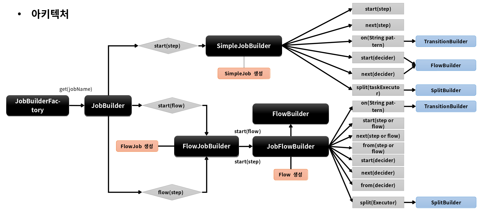
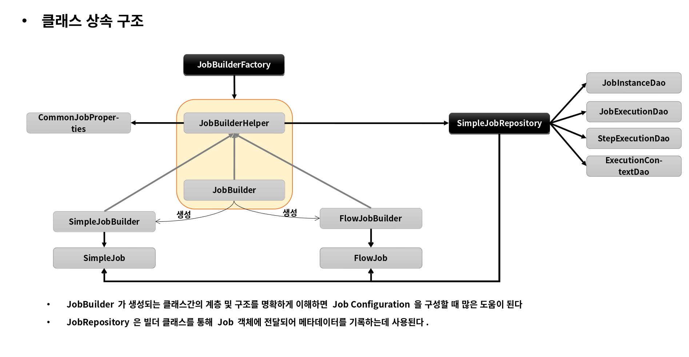
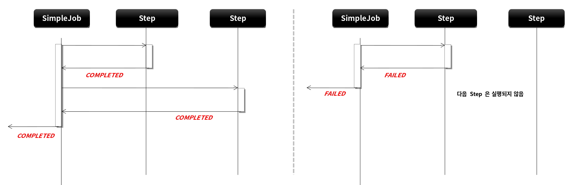
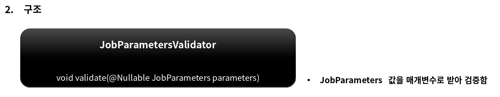
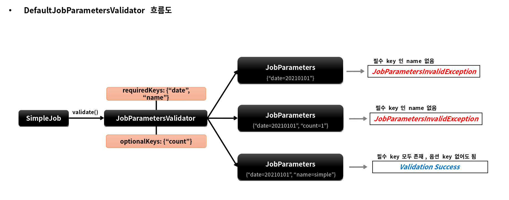

# 배치 실행

---

# 배치 초기화 설정

## JobLauncherApplicationRunner

- Spring Batch 작업을 시작하는 ApplicationRunner 로서 BatchAutoConfiguration 에서 생성됨 
- 스프링 부트에서 제공하는 ApplicationRunner 의 구현체로 어플리케이션이 정상적으로 구동되자 마자 실행됨 
- 기본적으로 빈으로 등록된 모든 Job을 실행시킨다 

## BatchProperties

- Spring Batch 의 환경 설정 클래스 
- Job 이름, 스키마 초기화 설정, 테이블 Prefix 등의 값을 설정할 수 있다 
- application.properties 또는 application.yml 파일에 설정함 

  - spring.batch.job.names: ${job.name:NONE}
  - spring.batch.jdbc.initialize-schema: embedded, never, always (default: embedded)
  - spring.batch.jdbc.table-prefix: BATCH_ (default) 

## Job 실행 옵션

- 지정한 Batch Job만 실행하도록 할 수 있음
- spring.batch.job.names: ${job.name:NONE}
- 어플리케이션 실행시 Program arguments 로 Job 이름을 입력한다
 
  - --job.name=helloJob
  - --job.name=helloJob,simpleJob (하나 이상의 Job을 실행 할 경우 쉼표로 구분해서 입력함)


참고
BatchAutoConfiguration -> JobLauncherApplicationRunner -> setJobs -> run(ApplicationArguments args(JobParameter로 전달한 값)) -> launchJobFromProperties(Properties) -> executeLocalJobs(JobParameters)

--- 
---

# Job and Step

---

# JobBuilderFactory / JobBuilder

스프링 배치는 Job 과 Step을 쉽게 생성 및 설정할 수 있도록 util 성격의 빌더 클래스들을 제공

## JobBuilderFactory

- JobBuiler 를 생성하는 팩토리 클래스로서 get(String name) 메서드 제공
- JobBuilderFactory.get("jobName")
  - "jobName" 은 스프링 배치가 Job을 실행시킬 때 참조하는 Job 이름

## JobBuilder

- Job을 구성하는 설정 조건에 따라 두 개의 하위 빌더 클래스를 생성하고 실제 Job 생성을 위임한다

### SimpleJobBuilder

- SimpleJob 을 생성하는 Builder 클래스  
- Job 실행과 관련된 여러 설정 API를 제공한다 

### FlowJobBuilder

- FlowJob 을 생성하는 Builder 클래스 
- 내부적으로 FlowBuilder 를 반환함으로써 Flow 실행과 관련된 여러 설정 API를 제공한다 





---

# SimpleJob

## 개념

- SimpleJob은 Step을 실행시키는 Job 구현체로서 SimpleJobBuilder에 의해 생성

- 여러 단계의 Step으로 구성할 수 있으며 Step을 순차적으로 실행

- 모든 Step의 실행이 성공적으로 완료되어야 Job이 성공적으로 완료 된다 

- 맨 마지막에 실행한 Step의 BatchStatus 가 최종 BatchStatus 가 된다

## 흐름



## API

JobBuilderFactory > JobBuilder > SimpleJobBuilder > SimpleJob

```java
public Job batchJob() {
    return jobBuilderFactory.get("batchJob")        // JobBuilder 를 생성하는 팩토리,  Job 의 이름을 매개변수로 받음
            .start(Step)                            // 처음 실행 할 Step 설정,  최초 한번 설정, 이 메서드를 실행하면 SimpleJobBuilder 반환
            .next(Step)                             // 다음에 실행 할 Step 설정, 횟수는 제한이 없으며 모든 next() 의 Step 이 종료가 되면 Job 이 종료된다
            .incrementer(JobParametersIncrementer)  // JobParameter 의 값을 자동을 증가해 주는 JobParametersIncrementer 설정
            .preventRestart(true)                   // Job 의 재 시작 가능 여부 설정, 기본값은 true
            .validator(JobParameterValidator)       // JobParameter 를 실행하기 전에 올바른 구성이 되었는지 검증하는 JobParametersValidator 설정
            .listener(JobExecutionListener)         // Job 라이프 사이클의 특정 시점에 콜백 제공받도록 JobExecutionListener 설정 
            .build();                               // SimpleJob 생성
}
```

## validator()

### 개념

- Job 실행에 꼭 필요한 파라미터를 검증하는 용도

- DefaultJobParametersValidator 구현체를 지원하며, 좀 더 복잡한 제약조건이 있다면 인터페이스를 직접 구현할 수도 있음 

- 검증이 2번 수행 됨 
  1. Job 이 수행 되기 전에 JobRepository에 기능이 수행되기 전 단계 (SimpleJobLauncher)
  2. Job 이 실행 되기 전에 (AbstractJob - execute)

### 구조



### 흐름도 


