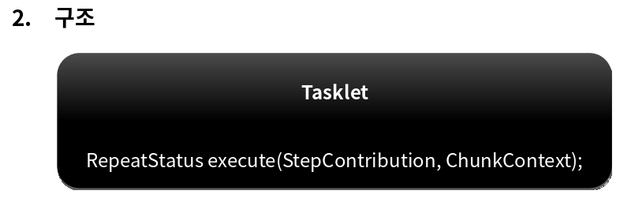

# 배치 실행

---

# StepBuilderFactory / StepBuilder

## StepBuilderFactory

- StepBuilder 를 생성하는 팩토리 클래스로서 get(String name) 메서드 제공
- StepBuilderFactory.get("stepName");

## StepBuilder

- Step을 구성하는 설정 조건에 따라 다섯개의 하위 빌더 클래스를 생성하고 실제 Step 생성을 위임한다

### TaskletStepBuilder

- TaskletStep을 생성하는 기본 빌더 클래

### SimpleStepBuilder

- TaskletStep을 생성하며 내부적으로 청크기반의 작업을 처리하는 ChunkOrientedTasklet 클래스를 생성한다

### PartitionStepBuilder

- PartitionStep을 생성하며 멀티 스레드 방식으로 Job을 실행한다 

### JobStepBuilder

- JobStep을 생성하여 Step 안에서 Job을 실행한다 

### FlowStepBuilder

- FlowStep을 생성하여 Step 안에서 Flow를 실행한다


---

# TaskletStep

## 개념

- 스프링 배치에서 제공하는 Step의 구현체로서 Tasklet 을 실행시키는 도메인 객체 
- RepeatTemplate 를 사용해서 Tasklet의 구문을 트랜잭션 경계 내에서 반복해서 실행함
- Task 기반과 Chunk 기반으로 나누어서 Tasklet 을 실행함

## Task vs Chunk 기반 비교

- 스프링 배치에서 Step의 실행 단위는 크게 2가지로 나누어짐

### Chunk 기반

- 하나의 큰 덩어리를 n개씩 나눠서 실행한다는 의미로 대량 처리를 하는 경우 효과적으로 설계 됨 
- ItemReader, ItemProcessor, ItemWriter 를 사용하며 청크 기반 전용 Tasklet 인 ChunkOrientedTasklet 구현체가 제공된다 

### Task 기반 

- ItemReader와 ItemWriter와 같은 청크 기반의 작업 보다 단일 작업 기반으로 처리되는 것이 더 효율적인 경우
- 주로 Tasklet 구현체를 만들어 사용 
- 대량 처리를 하는 경우 Chunk 기반에 비해 더 복잡한 구현 필요


### 생성

StepBuilderFactory -> StepBuilder -> TaskletStepBuilder -> TaskletStep

```java
public Step batchStep() {
    return stepBuilderFactory.get(“batchStep")  // StepBuilder 를 생성하는 팩토리,  Step 의 이름을 매개변수로 받음
        .tasklet(Tasklet)                       // Tasklet 클래스 설정, 이 메서드를 실행하면 TaskletStepBuilder 반환
        .startLimit(10)                         // Step의 실행 횟수를 설정, 설정한 만큼 실행되고 초과시 오류 발생, 기본값음 INTEGER.MAX_VALUE
        .allowStartIfComplete(true)             // Step의 성공, 실패와 상관없이 항상 Step 을 실행하기 위한 설정
        .listener(StepExecutionListener)        // Step 라이프 사이클의 특정 시점에 콜백 제공받도록 StepExecutionListener 설정
        .build();                               // TaskletStep 을 생성
}
```

- Task 기반의 TaskletStep 생성 
```java
public Step step(){
    return stepBuilderFactory.get("step")
        .tasklet(myTasklet())
        .build();
}
```

- Chunk 기반의 TaskletStep 생성
```java
public Step step(){
    return stepBuilderFactory.get("step")
        .<String, String> chunk(100)
        .reader()
        .processor()
        .writer()
        .build()
}
```


---

# tasklet()

## 개념

- Tasklet 타입의 클래스를 설정한다
- 익명 클래스 혹은 구현 클래스를 만들어서 사용한다
- 이 메소드를 실행하게 되면 TaskletStepBuilder가 반환되어 관련 API를 설정할 수 있다
- Step에 오직 하나의 Tasklet 설정이 가능하며 두개 이상을 설정했을 경우 마지막에 설정한 객체가 실행된
 
## Tasklet

- Step 내에서 구성되고 실행되는 도메인 객체로서 주로 단일 태스크를 수행하기 위한 것
- TaskletStep에 의해 반복적으로 수행되며 반환값에 따라 계속 수행 혹은 종료한다
- RepeatStatus - Tasklet의 반복 여부 상태 값
  - RepeatStatus.FINISHED - Tasklet 종료, RepeatStatus를 null 로 반환하면 RepeatStatus.FINISHED로 해석됨
  - RepeatStatus.CONTINUABLE - Tasklet 반복
  - RepeatStatus.FINISHED가 리턴되거나 실패 예외가 던져지기 전까지 TaskletStep에 의해 while 문 안에서 반복적으로 호출됨 (무한루프 주)



```java
public Step batchStep() {
    return stepBuilderFactory.get(“batchStep")
        .tasklet(new Tasklet() {
            @Override
            public RepeatStatus execute(StepContribution contribution, ChunkContext chunkContext) throws Exception {
                // To do Business Logic
                return RepeatStatus.FINISHED; }
            })
        .startLimit(10)
        .allowStartIfComplete(true)
        .listener(StepExecutionListener)
        .build();
}
```
