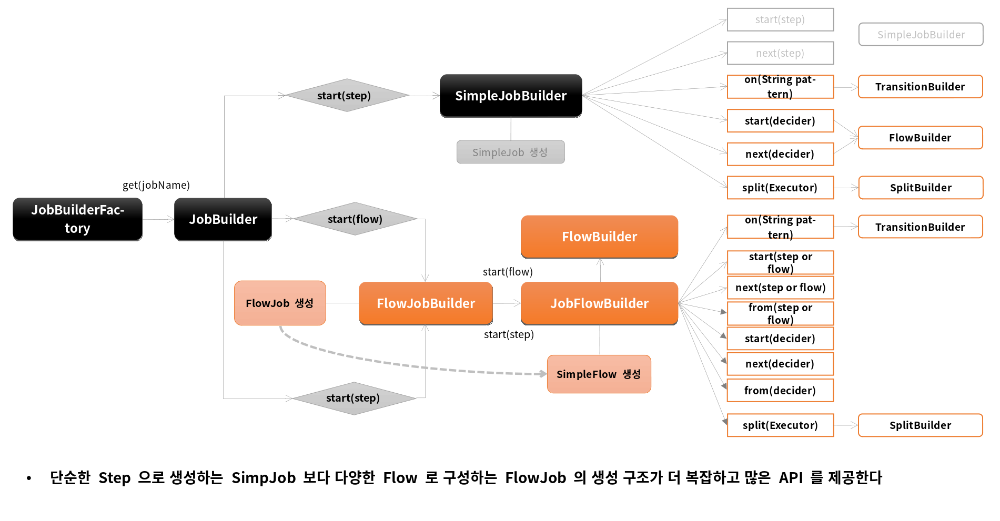
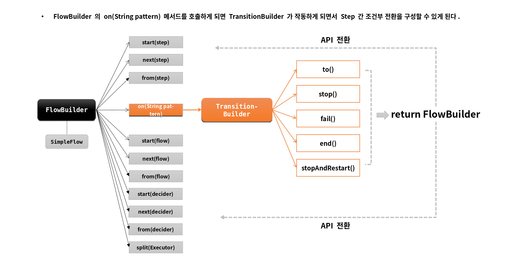

# 배치 실행

---

# FlowJob

## 개념

- Step을 순차적으로만 구성하는 것이 아닌 특정한 상태에 따라 흐름을 전환하도록 구성할 수 있으며 FlowJobBuilder 에 의 해 생성된다
  - Step이 실패하더라도 Job은 실패로 끝나지 않도록 해야하는 경우
  - Step이 성공했을 때 다음에 실행해야 할 Step을 구분해서 실행해야 하는 경우
  - 특정 Step은 전혀 실행되지 않게 구성해야 하는 경우
- Flow와 Job의 흐름을 구성하는데만 관여하고 실제 비즈니스 로직은 Step에서 이루어진다
- 내부적으로 SimpleFlow 객체를 포함하고 있으며 Job 실행시 호출한다

## SimpleJob vs FlowJob


## API

JobBuilderFactory > JobBuilder > JobFlowBuilder > FlowBuilder > FlowJob

```java
public Job batchJob() {
    return jobBuilderFactory.get(“batchJob")        
        .start(Step)                                // Flow 시작하는 Step 설정
        .on(String pattern)                         // Step의 실행 결과로 돌려받는 종료상태 (ExitStatus)를 캐치하여 매칭하는 패턴, TransitionBuilder 반환
        .to(Step)                                   // 다음으로 이동할 Step 지정
        .stop() / fail() / end() / stopAndRestart() // Flow 를 중지 / 실패 / 종료 하도록  Flow 종료
        .from(Step)                                 // 이전 단계에서 정의한 Step 의 Flow 를 추가적으로 정의함
        .next(Step)                                 // 다음으로 이동할 Step 지정
        .end()                                      // build() 앞에 위치하면 FlowBuilder 를 종료하고 SimpleFlow 객체 생성
        .build()                                    // FlowJob 생성하고 flow 필드에 SimpleFlow 저장
}
```

- start(), from(), next() -> Flow: 흐름을 정의하는 역할
- on(), to(), stop(), fail(), end(), stopAndRestart() -> Transition: 조건에 따라 흐름을 전환시키는 역할 





---

# start() / next()

```java
public Job batchJob() {
        return jobBuilderFactory.get(“batchJob")        
        .start(Step)                                // 처음 실행할 Flow 설정, JobFlowBuilder 가 반환된다
                                                    // 여기에 Step이 인자로 오게 되면 SimpleJobBuilder 가 반환
        .next(Step or Flow or JobExecutionDecider)
        .on(String pattern)
        .to(Step)
        .stop() / fail() / end() / stopAndRestart()
        .from(Step)
        .next(Step)
        .end()
        .build()
        }
```

---

# Transition

## 배치 상태 유형

- BatchStatus
- ExitStatus
- FlowExecutionStatus

--- 
## BatchStatus

- JobExecution 과 StepExecution 의 속성으로 Job 과 Step 의 종료 후 최종 결과 상태가 무엇인지 정의

### SimpleJob

- 마지막 Step의 BatchStatus 값을 Job의 최종 BatchStatus 값으로 반영
- Step이 실패할 경우 해당 Step이 마지막 Step이 된다

### FlowJob

- Flow내 Step의 ExitStatus 값을 FlowExecutionStatus 값으로 저장
- 마지막 Flow 의 FlowExecutionStatus 값을 Job의 최종 BatchStatus 값으로 반영

```java
public enum BatchStatus {
    COMPLETED, STARTING, STARTED, STOPPING, STOPPED, FAILED, ABANDONED, UNKNOWN;
}
```
- ABANDONED는 처리를 완료했지만 성공하지 못한 단계와 재시작시 건너 뛰어야하는 단계 

---
## ExitStatus

- JobExecution 과 StepExecution 의 속성으로 Job 과 Step의 실행 후 어떤 상태로 종료되었는지 정의
- 기본적으로 ExitStatus 는 BatchStatus 와 동일한 값으로 설정된다 

### SimpleJob

- 마지막 Step의 ExitStatus 값을 Job의 최종 ExitStatus 값으로 반영

### FlowJob

- Flow 내 Step의 ExitStatus 값을 FlowExecutionStatus 값으로 저장
- 마지막 Flow의 FlowExecutionStatus 값을 Job의 최종 ExitStatus 값으로 반영

```java
import java.io.Serializable;

public class ExitStatus implements Serializable, Comparable<ExitStatus> {
    public static final ExitStatus UNKNOWN = new ExitStatus("UNKNOWN");
    public static final ExitStatus EXECUTING = new ExitStatus("EXECUTING");
    public static final ExitStatus COMPLETED = new ExitStatus("COMPLETED");
    public static final ExitStatus NOOP = new ExitStatus("NOOP");
    public static final ExitStatus FAILED = new ExitStatus("FAILED");
    public static final ExitStatus STOPPED = new ExitStatus("STOPPED");
    
    private final String exitCode;
}
```

---
## FlowExecutionStatus

- FlowExecution의 속성으로 Flow의 실행 후 최종 결과 상태가 무엇인지 정의
- Flow 내 Step 이 실행되고 나서 ExitStatus 값을 FlowExecutionStatus 값으로 저장
- FlowJob 의 배치 결과 상태에 관여함

```java
public class FlowExecutionStatus implements Comparable<FlowExecutionStatus> {
  public static final FlowExecutionStatus COMPLETED = new FlowExecutionStatus(Status.COMPLETED.toString());
  public static final FlowExecutionStatus STOPPED = new FlowExecutionStatus(Status.STOPPED.toString());
  public static final FlowExecutionStatus FAILED = new FlowExecutionStatus(Status.FAILED.toString());
  public static final FlowExecutionStatus UNKNOWN = new FlowExecutionStatus(Status.UNKNOWN.toString());

  private enum Status {
    COMPLETED, STOPPED, FAILED, UNKNOWN;
  }
}
```


---

# Transition

## 개념

- Flow 내 Step의 조건부 전환(전이)을 정의함
- Job의 API 설정에서 on(String pattern) 메소드를 호출하면 TransitionBuilder가 반환되어 TransitionFlow를 구성할 수 있음
- Step의 종료상태(ExitStatus)가 어떤 pattern과도 매칭되지 않으면 스프링 배치에서 예외를 발생하고 Job은 실패
- transition은 구체적인 것부터 그렇지 않은 순서로 적용된다

## API

- on(String pattern)
  - Step의 실행 결과로 돌려받는 종료상태(ExitStatus)와 매칭하는 패턴 스키마, BatchStatus와 매칭하는 것이 아님
  - pattern과 ExitStatus와 매칭이 되면 다음으로 실행할 Step을 지정할 수 있다
  - 특수문자는 두 가지만 허용
    - "*": 0개 이상의 문자와 매칭, 모든 ExitStatus와 매칭된다
      - "c*t"는 "cat", "count"에 매칭
    - "?": 정확히 1개의 문자와 매칭
      - "c?t"는 "cat"에는 매칭되지만 "count"에는 매칭되지 않음 

- to()
  - 다음으로 실행할 단계를 지정

- from()
  - 이전 단계에서 정의한 Transition을 새롭게 추가 정의함 

## Job을 중단하거나 종료하는 Transition API

Flow가 실행되면 FlowExecutionStatus에 상태값이 저장되고 최종적으로 Job의 BatchStatus 와 ExitStatus에 반영된다  
Step의 BatchStatus 및 ExitStatus에는 아무런 영향을 주지 않고 Job의 상태만을 변경한다 

- stop()
  - FlowExecutionStatus가 STOPPED 상태로 종료되는 transition
  - Job의 BatchStatus와 ExitStatus가 STOPPED 으로 종료됨

- fail()
  - FlowExecutionStatus 가 FAILED 상태로 종료되는 transition
  - Job의 BatchStatus와 ExitStatus가 FAILED 으로 종료됨

- end()
  - FlowExecutionStatus 가 COMPLETED 상태로 종료되는 transition
  - Job의 BatchStatus와 ExitStatus가 COMPLETED 으로 종료됨
  - Step의 ExitStatus가 FAILED 이더라도 Job의 BatchStatus가 COMPLETED로 종료하도록 가능하며 이 때 Job의 재시작은 불가능함

- stopAndRestart(Step or Flow or JobExecutionDecider)
  - stop() transition과 기본 흐름은 동일
  - 특정 Step에서 작업을 중단하도록 설정하면 중단 이전의 Step만 COMPLETED 저장되고 이후의 Step은 실행되지 않고 STOPPED 상태로 Job 종료
  - Job이 다시 실행됐을 때 실행해야 할 Step을 restart 인자로 넘기면 이전에 COMPLETED로 저장된 Step은 건너뛰고 중단 이후 Step 부터 시작한다

---

# Custom ExitStatus

## 개념

- ExitStatus에 존재하지 않는 exitCode를 새롭게 정의해서 설정
- StepExecutionListener의 afterStep() 메서드에서 Custom ExitCode 생성 후 새로운 ExitStatus 반환
- Step 실행 후 완료 시점에서 현재 ExitCode를 사용자 정의 ExitCode로 수정할 수 있음

### AbstractStep <- TaskletStep
```java
exitStatus = exitStatus.and(stepExecution.getExitStatus());
stepExecution.setExitStstua(exitStatus);
exitStatus = exitStatus.and(getCompositeListener().afterStep(stepExecution));
```

---

# JobExecutionDecider

## 개념

- ExitStatus 를 조작하거나 StepExecutionListener 를 등록할 필요 없이 Transition 처리를 위한 전용 클래스
- Step 과 Transition 역할을 명확히 분리해서 설정 할 수 있음
- Step 의 ExitStatus 가 아닌 JobExecutionDecider 의 FlowExecutionStatus 상태값을 새롭게 설정해서 반환함

## 구조

```java
public interface JobExecutionDecider {
  FlowExecutionStatus decide(JobExecution jobExecution, @Nullable StepExecution stepExecution);
}
```

SimpleFlow.start(FlowExecutor) .resume() -> DecisionState.handle()
