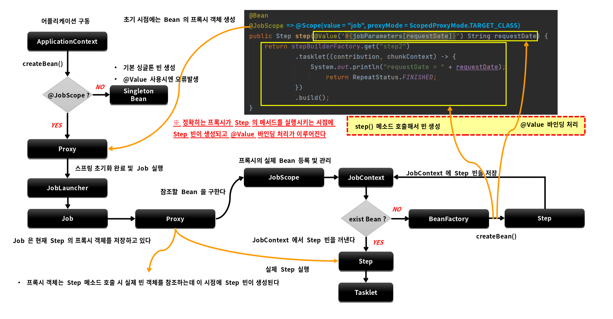

# 배치 실행

---

# Scope

- 스프링 컨테이너에서 빈이 관리되는 범위
- Singleton, Prototype, Request, Session, Application 이 있으며 기본은 Singleton으로 생성됨

# 배치 스코프

- Job과 Step의 빈 생성과 실행에 관여하는 스코프
- 프록시 모드를 기본값으로 하는 스코프
  - @Scope(value = "job", proxyMode = ScopeProxyMode.TARGET_CALSS)
- 해당 스코프가 선언되면 빈이 생성이 어플리케이션 구동시점이 아닌 빈의 실행시점에 이루어진다
  - @Value를 주입해서 빈의 실행 시점에 값을 참조할 수 있으며 일종의 Lazy Binding이 가능해 진다
  - @Value("#{jobParameters[파라미터명]}"), @Value("#{jobExecutionContext[파라미터명]}"), @Value("#{stepExecutionContext[파라미터명]}"), 
  - @Value를 사용할 경우 빈 선언문에 @JobScope, @StepScope를 정의하지 않으면 오류를 발생하므로 반드시 선언해야 함
- 프록시 모드로 빈이 선언되기 때문에 어플리케이션 구동시점에는 빈의 프록시 객체가 생성되어 실행 시점에 실제 빈을 호출해 준다
- 병렬처리시 각 스레드 마다 생성된 스코프 빈이 할당되기 때문에 스레드에 안전하게 실행이 가능하다 

## @JobScope

- Step 선언문에 정의한다
- @Value : jobParameter, jobExecutionContext 만 사용가

## @StepScope

- Tasklet이나 ItemReader, ItemWriter, ItemProcessor 선언문에 정의한다
- @Value : jobParameter, jobExecutionContext, stepExecutionContext 사용가능

---

# Proxy 객체

@JobScope   
-> @Scope(value = "job", proxyMode = ScopeProxyMode.TARGET_CALSS)
@StepScope   
-> @Scope(value = "step", proxyMode = ScopeProxyMode.TARGET_CALSS)

- @JobScope, @StepScope 어노테이션이 붙은 빈 선언은 내부적으로 빈의 Proxy 객체가 생성된다 
- Job 실행 시 Proxy 객체가 실제 빈을 호출해서 해당 메서드를 실행시키는 구조 

## JobScope, StepScope

- Proxy 객체의 실제 대상이 되는 Bean을 등록, 해제하는 역할
- 실제 빈을 저장하고 있는 JobContext, StepContext 를 가지고 있다 

## JobContext, StepContext

- 스프링 컨테이너에서 생성된 빈을 저장하는 컨텍스트 역할
- Job의 실행 시점에서 프록시 객체가 실제 빈을 참조할 때 사용됨

### JdkDynamicAopProxy

- targetSource.getTarget();
- JobScope get() - 실제 구현 객체를 반환한다

