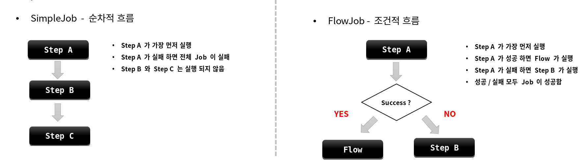
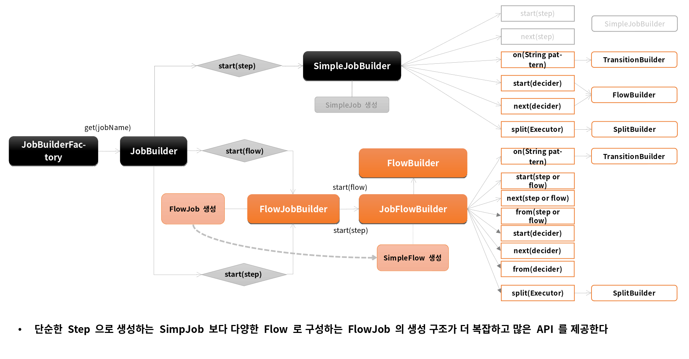
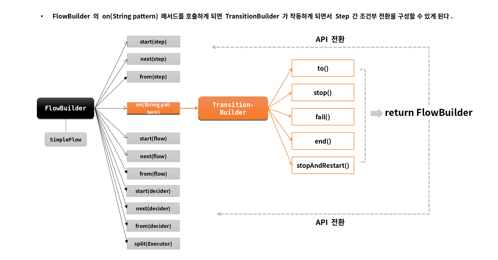

# 배치 실행

---

# FlowJob

## 개념

- Step을 순차적으로만 구성하는 것이 아닌 특정한 상태에 따라 흐름을 전환하도록 구성할 수 있으며 FlowJobBuilder 에 의 해 생성된다
  - Step이 실패하더라도 Job은 실패로 끝나지 않도록 해야하는 경우
  - Step이 성공했을 때 다음에 실행해야 할 Step을 구분해서 실행해야 하는 경우
  - 특정 Step은 전혀 실행되지 않게 구성해야 하는 경우
- Flow와 Job의 흐름을 구성하는데만 관여하고 실제 비즈니스 로직은 Step에서 이루어진다
- 내부적으로 SimpleFlow 객체를 포함하고 있으며 Job 실행시 호출한다

## SimpleJob vs FlowJob



## API

JobBuilderFactory > JobBuilder > JobFlowBuilder > FlowBuilder > FlowJob

```java
public Job batchJob() {
    return jobBuilderFactory.get(“batchJob")        
        .start(Step)                                // Flow 시작하는 Step 설정
        .on(String pattern)                         // Step의 실행 결과로 돌려받는 종료상태 (ExitStatus)를 캐치하여 매칭하는 패턴, TransitionBuilder 반환
        .to(Step)                                   // 다음으로 이동할 Step 지정
        .stop() / fail() / end() / stopAndRestart() // Flow 를 중지 / 실패 / 종료 하도록  Flow 종료
        .from(Step)                                 // 이전 단계에서 정의한 Step 의 Flow 를 추가적으로 정의함
        .next(Step)                                 // 다음으로 이동할 Step 지정
        .end()                                      // build() 앞에 위치하면 FlowBuilder 를 종료하고 SimpleFlow 객체 생성
        .build()                                    // FlowJob 생성하고 flow 필드에 SimpleFlow 저장
}
```

- start(), from(), next() -> Flow: 흐름을 정의하는 역할
- on(), to(), stop(), fail(), end(), stopAndRestart() -> Transition: 조건에 따라 흐름을 전환시키는 역할 





---

# start() / next()

```java
public Job batchJob() {
        return jobBuilderFactory.get(“batchJob")        
        .start(Step)                                // 처음 실행할 Flow 설정, JobFlowBuilder 가 반환된다
                                                    // 여기에 Step이 인자로 오게 되면 SimpleJobBuilder 가 반환
        .next(Step or Flow or JobExecutionDecider)
        .on(String pattern)
        .to(Step)
        .stop() / fail() / end() / stopAndRestart()
        .from(Step)
        .next(Step)
        .end()
        .build()
        }
```
